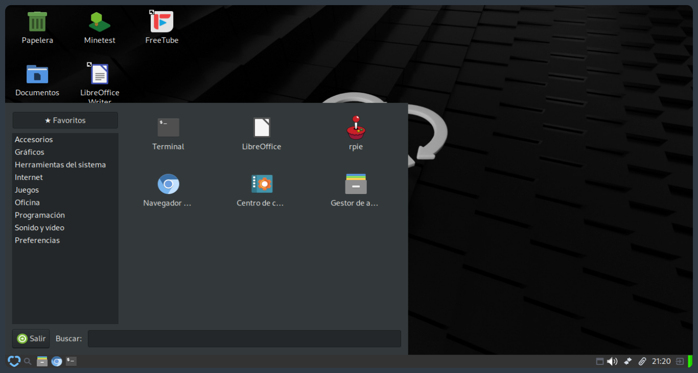
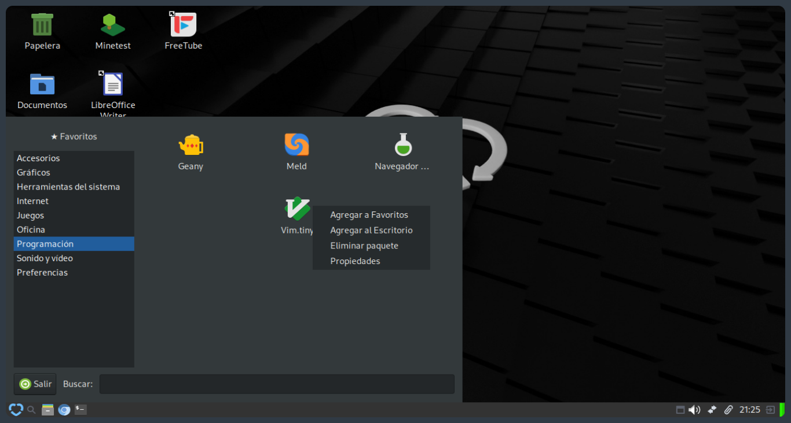
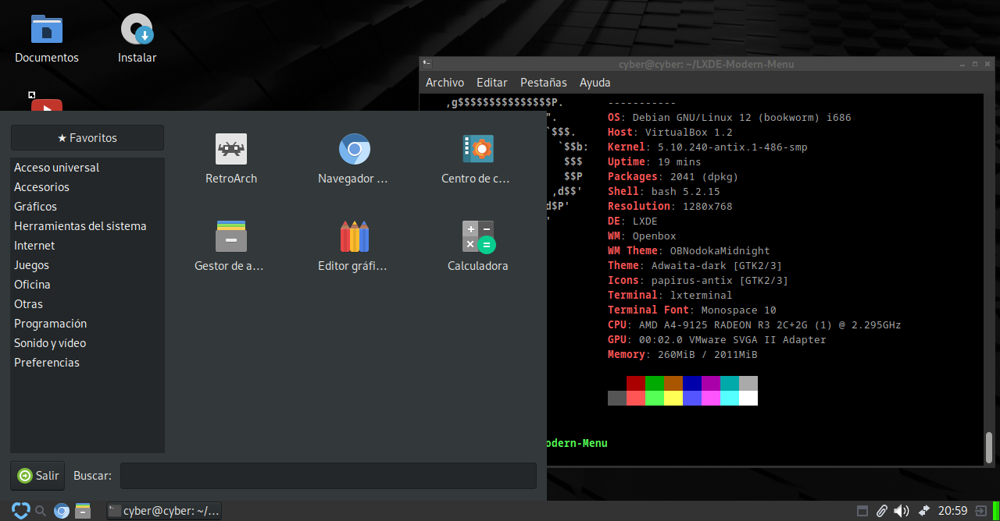
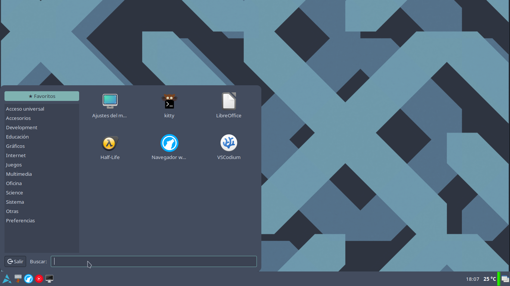

# LXDE-Modern-Menu
A more modern-style application menu for LXDE

### Choose your preferred language:  
[](README.es.md)

## Project Goal

The goal of this project is to add a more modern and intuitive-looking menu to LXDE for new users, without losing the characteristic lightness of the environment. The design is partially inspired by KDE's style, and includes:

- ⭐ A **favorites section**, displayed when opening the menu  
- A **category list** on the left  
- An **application panel** with icons on the right  
- An integrated **search bar**  
- An **exit button** that runs the logout command configured in LXDE
- A **hidden applications list** to hide applications you don't want to delete but also don't want to see

A context menu that appears when you **right-click** on an application in the menu and includes the following options:

* **Add to favorites** / **Remove from favorites** (if already added)
* **Hide application**
* **Add to desktop** (if not already there)
* **Remove package**
* **Properties**

## Sample Images
These are images of the menu in the Argentine distribution Cirujantix from the Cybercirujas group, which comes with the menu preinstalled:

  
  


## Style Support
This is a sample of how the menu can look if you have a GTK theme installed, such as for example a Nord-style theme:



---
## Installation

For Debian-based systems you can directly use the appropriate .deb file for your architecture. These files can be found in the repository's releases section.

Once downloaded, use the following command to install it on your system:

If you wish to remove it, you can do so either with ```dpkg -r modernmenu```, or with ```apt remove modernmenu```, both should work correctly.

## Configuration
If you right-click on the menu icon, the lxpanel context menu will appear where at the top will be the configuration option. If you click it, a small interface will appear where you can perform the following actions:

* **Modify the icon**
* **Modify hidden applications**

To modify the icon you can either paste the path directly, enter the icon name (for example: app-launcher) or click **Browse** and search for the icon or image you want among your system's folders.

To modify hidden applications we have the **Manage** button, which when clicked will open another window where you can see which applications are hidden and next to them the **Show** option to stop hiding them.

## Compilation
To compile it first make sure to install the following packages

```bash
sudo apt install build-essential pkg-config libgtk2.0-dev lxpanel-dev libmenu-dev
```

and then, being in the folder, run

```bash
make
make install
make run
```

**`make install`** will automatically copy the plugin to the path where the lxpanel/plugins folder is located.

**`make run`** will restart lxpanel so it detects the plugin correctly. Sometimes running it many times ends up crashing the session and you need to run lxsession again for it to work.

## 32-bit Compilation
When compiling for 32 bits the steps change a bit since in this case the package name **`libmenu-dev`** in Debian 32 bits changes and **`libmenu-cache-dev`** is used instead, so the command would be:

```bash
sudo apt install build-essential pkg-config libgtk2.0-dev lxpanel-dev libmenu-cache-dev
```

After installing the packages, run **`make 32bits`** and to install **`make install-32bits`**.

## Packaging
The repository includes a script to create `.deb` packages with the following options:

Create package for 64 bits
```bash
./create-deb.sh
```
Create package for 32 bits
```bash
./create-deb.sh 32bits
```
Clean generated packages
```bash
./create-deb.sh clean
```

## Translations
The menu supports multiple languages through gettext. The translation files are in the `po/` folder.

### Adding a new language:
```bash
make new-lang LANG=code
# Example: make new-lang LANG=fr
# Edit po/fr.po
make update-po
```

### Available languages:
- Spanish (es)
- English (default)
- Portuguese (pt)

## Acknowledgments

Thanks to Uctumi from Cybercirujas for all the feedback that allowed me to improve this project and for helping me with the 32-bit version, without their help I might not have thought about making the version for this architecture.

Thanks to Nico from Locos por Linux for the help during livestreams and for including the menu in Loc-OS 24, thanks to this I got motivated to add translation support.
